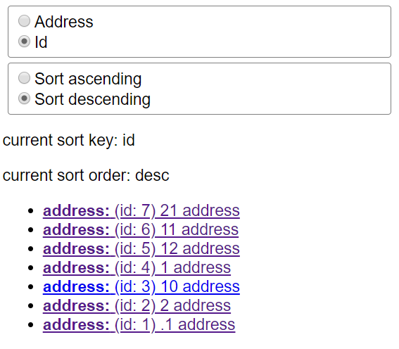
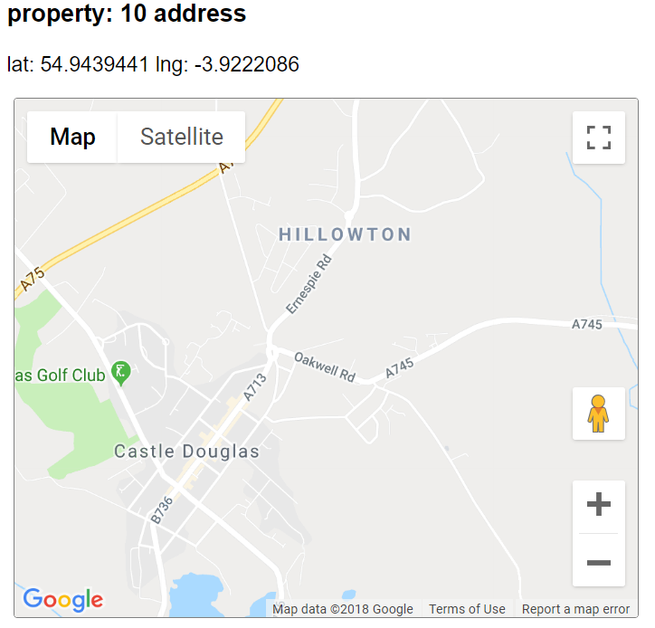

# Code Test

**Here is the code test and my own assesment of what I submitted.**

We are looking for clean code, in a readable format. Stlying is not expected but a bonus (and a little may be required for task 2), and should not be inline.

**Some very basic styling has been added. Obviously radio groups should have a caption and some material design or bootstrap in a responsive grid would be better.**

**The code probably shows that I am not an expert in Relay and Graph QL. I must also confess that I am not a big fan. My first impression is that it adds quite a bit of complexity to the code. I keep investigating new technologies and at the moment I am looking into writing MVC Javascript apps with Redux and React which I find a bit easier. I understand though that it is not as powerful as Relay and would have no problem coding with that Framework instead.** 

The code should be tested (task 1), and those tests should pass.

**The code has been tested and passes, new test cases have been added where needed.**

You will need a Google Maps API key for task 2, which can be obtained here: https://developers.google.com/maps/documentation/javascript/get-api-key)

The `MapComponent` should be connected by relay, and should accept a `location` prop.

**I created an API key but since yours is working and is in the code...**

**I tried to use the react map component and ran into cryptic errors such as:**

`Uncaught (in promise) Error: Did you wrap <GoogleMap> component with withGoogleMap() HOC?`

**After fiddling with the examples for a while I came to the conclusion that the component is not yet of sufficient quality, at least in term of documentation. It is my opinion that a component that cannot easily be used with a minimal example may not be entirely suited for production.**

## Getting Started

```npm install``` to install the packages

```npm run update-schema && npm run start```

you will be able to access the site: http://localhost:3001
you will be able to access the graph: http://localhost:3001/graphql

here is a basic graph query to input into the graphql.

```
{
  viewer {
    properties(sortKey: "address", sortOrder: "asc") {
      address,location {
        lat
        lng
      }
    }
  }
}
```

**This should give the following result:**

```
{
  "data": {
    "viewer": {
      "properties": [
        {
          "address": ".1 address",
          "location": {
            "lat": 51.608049,
            "lng": -0.1096416
          }
        },
...
```

## The Code

Both the `Javascript`, and the `sass` should be **linted** (`npm run lint` and `npm run sass-lint` respectively) - please do not alter the lint rules.

**lint.log contains the result. Lint seems mostly unhappy with VSCode code formatting and line-endings...**

The code should be added to a git repository (github, gitlab, bitbucket etc.)

## The Tasks

**Task One**

we have a problem! we are trying to sort our properties by address, but they're not sorted correctly! Our sort function uses lodash `sortBy` (https://lodash.com/docs/4.17.4#sortBy), but it's just not working, time to write a new function that does the job! (read: https://stackoverflow.com/questions/2802341/javascript-natural-sort-of-alphanumerical-strings)

first things first, have a look at the test in `/lib/graph/__tests__/sort.js` and run it by running `npm run test` you'll see it works for one test, but fails for another, the first task is to create/add the new function in to the sort file (`/lib/graph/utils/simpleSort`) and get the tests to pass - add some new tests if you want to be sure it does what you think it should

secondly, we want to be able to change the order on the sort function, so sometimes, it'll be ascending, (1, 2, 3, 4, 5), and sometimes descending (5, 4, 3, 2, 1), this should also be tested in the `/lib/graph/__tests__/sort.js` file

Finally, we need to make it so you can sort the list of addresses in the browser, currently it's sorted by `address, asc` and we need it to be sorted by address, or id, ascending or descending. There are functions being passed in already, they just need using, so your job is to build two simple elements that when changed (could be a drop down, or a radio button, or similar) will change the sort key from `address` to `id` or vice versa, and the sortOrder, from `asc` to `desc` or vice versa

**The list of address is sorted, if sorted by ID then the ID is shown in brackets:**



--

**Task Two**

You can access each property, by clicking on the property link in the list.

It currently just shows the address for each property, and we would like it to show a map as well. This will require a new component, which can be shown in the `PropertyPage`

each property has a lat/lng location in the `/lib/graph/utils/properties.js`, for this to be exposed on the front end, we need a new `loction type`, contating a lat/lng in the graph. Once that has been created, rebuild the schema/app (`npm run update-schema && npm run start` again), and you'll be able to see those values in the graph.

They can then be used on the front end, and passed into a component via a relay fragment. This component, should then be able to render a google map with the pin where the property location is. `react-google-maps` (https://github.com/tomchentw/react-google-maps) has already been installed via the package.json.

**The map is shown with a marker showing the location:**


